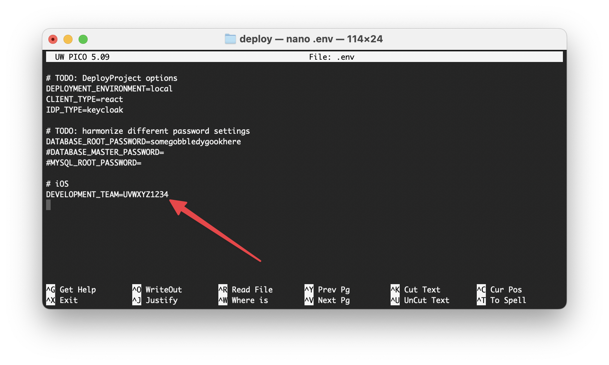
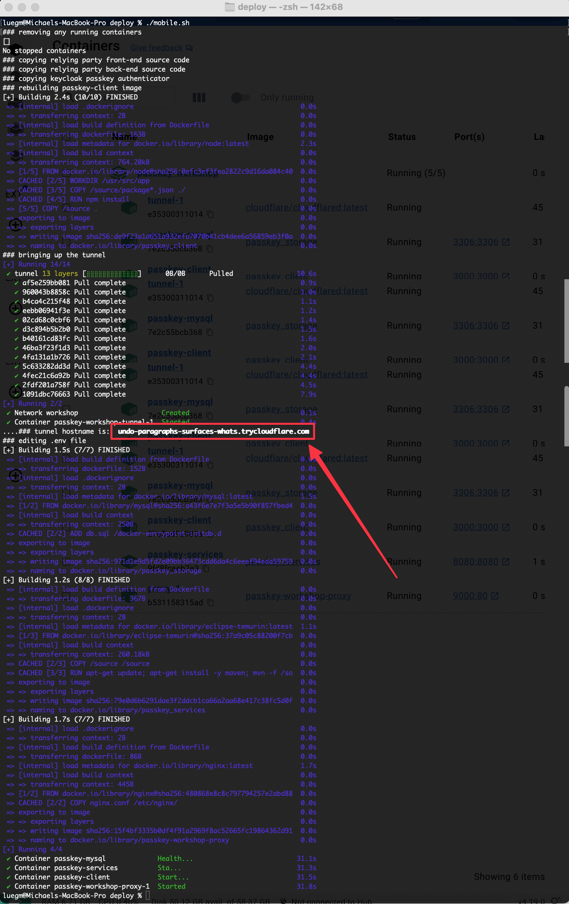

### 1. install Docker Desktop
https://www.docker.com/products/docker-desktop/

### 2. install Git
https://git-scm.com/downloads

### 3. get Apple Developer Team-ID (Optional)
https://developer.apple.com/help/account/manage-your-team/locate-your-team-id/
<div style="page-break-after: always;"></div>

### 4. setup the backend
#### automated / script (macOS and Linux):
`!! for windows scroll down`
1. Clone the repository
  ```bash
  git clone https://github.com/YubicoLabs/passkey-workshop
  ```
2. Navigate to the *deploy* folder
  ```bash
  cd passkey-workshop/deploy
  ```
3. run the *mobile.sh* script
  ```bash
  ./mobile.sh
  ```
4. edit *.env* file
	1. open the file
    ```bash
    nano .env
    ```
	2. make changes
	   
		1. if you have a Team-ID -> add it here
		2. if you don't have a Team-ID -> change one character
5. run the *mobile.sh* script again
  ```bash
  ./mobile.sh
  ``` 
6. copy the url from the shell
   
7. open the url in a browser `(use https://)`
8. go to the *TestPanel*
9. you can now register and sign in with passkeys
	1. note: only the TestPanel is working!

---

#### manual (windows):
  
0. start **Powershell**
1. Clone the repository
  ```bash
  git clone https://github.com/YubicoLabs/passkey-workshop
  ```
2. Navigate to the *deploy* folder
  ```bash
  cd passkey-workshop/deploy
  ```
3. Copy the environment file
  ```bash
  cp tunnel.env .env
  ```
4. Copy the frontend code
  ```bash
  cp -r ../examples/clients/web/react/passkey-client/ react-app/source
  ```
5. _(optional)_ Edit the *apple-app-site-association* file with your Apple TeamID. 
  ```bash
  nano react-app/source/public/.well-known/apple-app-site-association
  ```
  ```
  {
      "webcredentials": {
        "apps": [
          "UVWXYZ1234.fyi.passkey.pawskeyUVWXYZ1234"
        ]
      }
  }
  ```
6. Build the *passkey-client*
  ```bash
  docker compose build passkey-client
  ```
7. Copy the backend code
  ```bash
  cp -r ../examples/relyingParties/java-spring/ java-app/source/
  ```
8. Start your tunnel
  ```bash
  docker compose --profile tunnel up -d
  ```
9. Lookup the tunnel URL in cloudflared's output, either in Docker Desktop or using
  ```bash
  docker compose --profile tunnel logs
  ```
  ```
  *example log:*
  INF +--------------------------------------------------------------------------------------+
  INF | Your quick Tunnel has been created! Visit it at (it may take some time to be reachable): |
  INF | https://your-proxied-tunnel-endpoint.trycloudflare.com                                                       |
  INF +--------------------------------------------------------------------------------------+
  ```

10. Edit your .env file and set the values of `RP_ID`, `RP_ALLOWED_ORIGINS`, and `RP_ALLOWED_CROSS_ORIGINS` to your assigned hostname
  ```bash
  RP_ID=replace-with-your-hostname.trycloudflare.com
  RP_ALLOWED_ORIGINS=replace-with-your-hostname.trycloudflare.com
  RP_ALLOWED_CROSS_ORIGINS=replace-with-your-hostname.trycloudflare.com
  ```
  
  Also edit the URL for your RP backend API so it includes your tunnel hostname
	
  ```bash
  REACT_APP_API=https://replace-with-your-hostname.trycloudflare.com/v1
  ```
11. run
  ```bash
  docker compose --profile mobile up -d
  ```
12. open the url in a browser
13. go to the *TestPanel*
14. you can now register and sign in with passkeys
	1. note: only the TestPanel is working!


